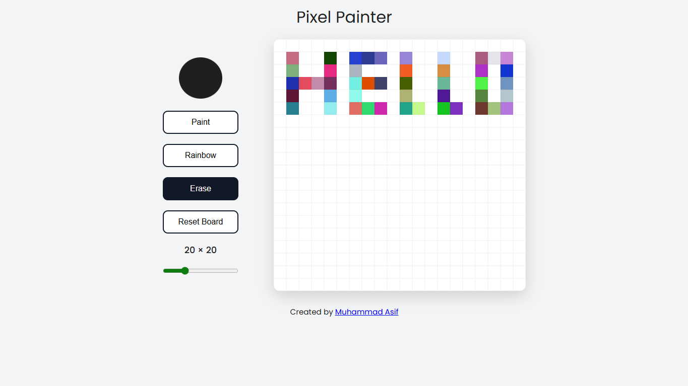

# Pixel Painter

[](https://muhammad-asif10.github.io/Etch-a-Sketch/)



A modern, interactive pixel-based drawing application built with vanilla JavaScript, HTML5, and CSS3. Create beautiful pixel art with an intuitive and responsive user interface.

## 🎨 Features

- **Drawing Tools**
  - 🎯 **Paint Mode**: Draw with a custom color of your choice
  - 🌈 **Rainbow Mode**: Create vibrant artwork with random colors
  - 🧹 **Eraser**: Clear pixels to create negative space
  
- **Grid Customization**
  - Adjustable grid size from 4×4 to 64×64
  - Real-time grid resizing with instant visual feedback
  
- **User-Friendly Interface**
  - Color picker for precise color selection
  - Reset button to clear the entire canvas
  - Clean, modern UI with smooth animations
  - Fully responsive design for desktop, tablet, and mobile devices
  
- **Intuitive Controls**
  - Click and drag to draw continuously
  - Tool switching with visual feedback (selected tool highlighting)
  - Live grid size display showing current dimensions

## 🚀 Getting Started

### Prerequisites
- A modern web browser (Chrome, Firefox, Safari, Edge)
- No additional dependencies or installations required

### Installation

1. Clone the repository:
```bash
git clone https://github.com/muhammad-asif10/Etch-a-Sketch.git
cd Etch-a-Sketch
```

2. Open the application:
```bash
# Simply open the index.html file in your browser
open index.html
# Or use a local server (optional)
python -m http.server 8000
# Then navigate to http://localhost:8000
```

## 💡 How to Use

1. **Select a Drawing Tool**: Click on "Paint", "Rainbow", or "Erase" buttons
2. **Choose Your Color**: Use the color picker to select your desired paint color (for Paint mode)
3. **Adjust Grid Size**: Use the slider to change the canvas grid size
4. **Start Drawing**: Click and drag on the canvas to draw
5. **Clear Canvas**: Click "Reset Board" to clear all pixels and start over

## 🎮 Demo

Open `index.html` in your web browser to start creating pixel art immediately. No setup or build process required!

## 📁 Project Structure

```
Etch-a-Sketch/
├── index.html      # Main HTML file with structure
├── styles.css      # Styling and responsive design
├── app.js          # Core application logic
├── github.svg      # GitHub icon asset
└── README.md       # Project documentation
```

## 🛠️ Technologies Used

- **HTML5**: Semantic markup and structure
- **CSS3**: Modern styling with CSS variables and flexbox/grid layout
- **JavaScript (Vanilla)**: Lightweight, dependency-free logic
- **Google Fonts**: Poppins font family for modern typography

## 🎯 Key Functionalities

### Drawing System
- Multi-tool support (Paint, Rainbow, Erase)
- Real-time pixel coloring with mouse events
- Continuous drawing with click-and-drag functionality

### Canvas Management
- Dynamic grid generation based on user input
- Responsive grid sizing from 4×4 to 64×64 pixels
- Instant canvas reset capability

### Responsive Design
- Mobile-first approach
- Adaptive layout for screens of all sizes
- Touch-friendly controls for mobile devices

## 🎨 Customization

You can easily customize the application by modifying:

- **Colors**: Edit CSS variables in `styles.css` (`:root` section)
- **Initial Grid Size**: Change `INITIAL_GRID_SIZE` in `app.js`
- **Default Paint Color**: Modify `INITIAL_COLOR` in `app.js`
- **Canvas Dimensions**: Adjust `.drawing-board` width/height in `styles.css`

## 📱 Browser Compatibility

- ✅ Chrome (latest)
- ✅ Firefox (latest)
- ✅ Safari (latest)
- ✅ Edge (latest)
- ✅ Mobile browsers (iOS Safari, Chrome Mobile)

## 📝 License

This project is open source and available under the MIT License.

## 👨‍💻 Author

**Muhammad Asif**
- GitHub: [@muhammad-asif10](https://github.com/muhammad-asif10)

## 🤝 Contributing

Contributions are welcome! Feel free to:
- Report bugs
- Suggest new features
- Submit pull requests
- Fork the repository and create your own version

## 🌟 Future Enhancements

Potential features for future versions:
- Undo/Redo functionality
- Save artwork as PNG/JPG
- Brush size selection
- Additional drawing tools (lines, shapes)
- Color history/palette
- Keyboard shortcuts
- Dark mode theme toggle

## 📞 Support

If you encounter any issues or have questions, please open an issue on the [GitHub repository](https://github.com/muhammad-asif10/Etch-a-Sketch/issues).

---

**Happy Creating! 🎨✨**
